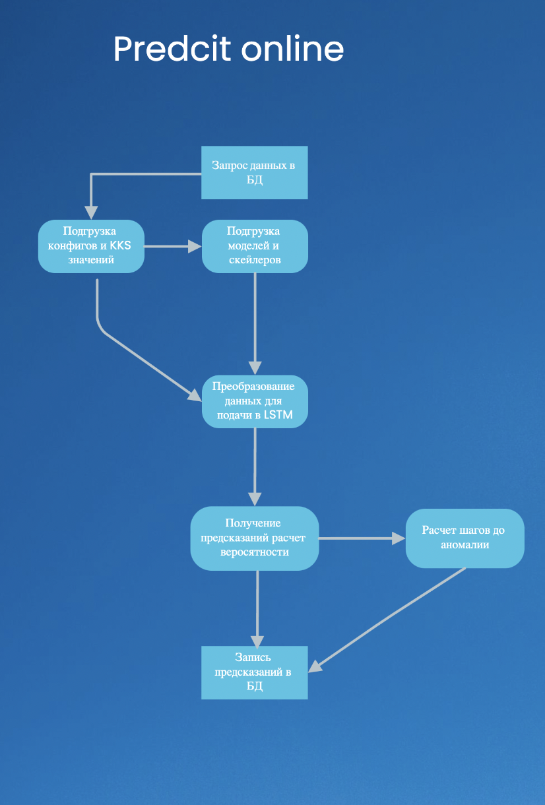

# Online lstm (version 1.0.0)

# Краткое описание программы


Этот код состоит из сценария на языке Python (`predict_online.py`), который загружает обученные модели LSTM и скейлеры, собирает данные из базы данных Clickhouse, применяет техники предварительной обработки данных, такие как скользящее среднее, экспоненциальное и двойное экспоненциальное сглаживание, подготавливает данные для каждой модели LSTM и генерирует прогнозы с использованием каждой модели. Затем он вычисляет значения потерь между предсказанными и истинными значениями для каждой модели и сохраняет их в другую таблицу базы данных Clickhouse.

# Запуск

Чтобы запустить скрипт, выполните следующие шаги:

1. Установите необходимые пакеты: `numpy`,` pandas`, `tensorflow`,` joblib`, `clickhouse_driver`

```bash
pip install -r requirements.txt
```

2. Измените файл конфигурации `config_online.yaml`, чтобы установить желаемые значения для следующих параметров:

   - `KKS`: Подгружается из базы данных, возможен запуск через csv при передаче аргумента при запуске скрипта `--csv_kks True`' путь к CSV-файлу, содержащему коды KKS внешних тегов, которые будут использоваться для каждой модели LSTM.
   - `WEIGHTS`: путь к папке с обученными моделями LSTM.
   - `SCALER`: путь к папке с соответствующими масштабировщиками каждой модели LSTM.
   - `NUM_GROUPS`: количество моделей LSTM, которые будут использоваться.
   - `LAG`: временная задержка, которая должна быть учтена для каждой модели LSTM.
   - `QUERY_DF`: запрос для извлечения данных из базы данных Clickhouse.
   - `TIME_BETWEEN_PREDICT`: время(задержка) между выполнением предсказаний.
   - `ROLLING_MEAN`: логическое значение, указывающее, применять ли скользящее среднее к данным или нет.
   - `EXP_SMOOTH`: логическое значение, указывающее, применять ли экспоненциальное сглаживание к данным или нет.
   - `DOUBLE_EXP_SMOOTH`: логическое значение, указывающее, применять ли двойное экспоненциальное сглаживание к данным или нет.
   - `ROLLING_MEAN_WINDOW`: размер окна, используемого для скользящего среднего.
   - `POWER_ID`: Идентификатор датчика мощности.
   - `POWER_LIMIT`: Заданный лимит отслеживания мощности, при котором система пересчитывает значения аномальности.
   - `TRAIN_LEN_FORECAST`: Длина выборки для обучения предсказательного алгоритма.
   - `LEN_FORECAST`: Длина предсказанной последовательности.
   - `WINDOW_SIZE`: Параметр шага предсказанной последовательнсти(параметр для настройки предсказательного алгоритма).
   - `TRESHOLD_ANOMALY`: Порог значения для определения аномальности.
   - `CONTINUE_COUNT`: Значение длителности аномального участка.
3. Запустите следующую команду для выполнения сценария:
<br> </br>

Для первого запуска(в случае если в БД от запустите команду:
```bash
python predict_online.py --config_path /path/to/config/ --firtst_start 
```
Для запуска скипта в работу: 
```bash
python predict_online.py --config_path /path/to/config/
```

Дополнительно: 
Для удаления таблиц с предсказаниями сети  LSTM из БД выполните команду:
```bash
python predict_online.py --config_path 
```

Примечание: замените `/path/to/config/` на фактический путь к папке с файлом `config_online.yaml`.

Скрипт будет работать непрерывно, запрашивая данные из базы данных Clickhouse каждые 5 минут, пока его не остановят вручную. Значения потерь между предсказанными и истинными значениями для каждой модели LSTM будут сохранены в таблицах с именами `lstm_groupX`, где `X` представляет номер группы соответствующей модели LSTM. Результаты могут быть получены запросом к базе данных Clickhouse. В таблицу будут записаны `prob` - вероятность аномалии, и значение `count` количество отсчетов(1 отсчет = 5 минут) до возниковения аномалии

# Описание алгоритмов

## Общая схема алгоритма

   1.**Импорт необходимых библиотек и модулей**

* Импорт необходимых библиотек и модулей, таких как `time`, `pandas`, `joblib`, `os`, `tensorflow`, `numpy`, `argparse`, `scipy`, `sys`, и других.
* Установка конфигурации и параметров программы.

2. **Подключение к ClickHouse и загрузка моделей и параметров**

   - Установка соединения с ClickHouse.
   - Загрузка моделей LSTM из предварительно сохраненных файлов.
   - Загрузка параметров скейлера и скейлера потерь из предварительно сохраненных файлов.
3. **Обработка входных данных**

   - Получение последнего DataFrame из ClickHouse.
   - Проверка значения мощности (`POWER_ID`) и выполнение дополнительных операций по обработке данных, таких как скользящее среднее, экспоненциальное сглаживание и другие.
   - Получение групп каналов (`KKS`) и приведение данных в соответствие с соответствующими скейлерами.
4. **Вычисление ошибки и вероятности аномалии**

- Для каждой группы моделей LSTM:

  - Получение данных группы и приведение их к соответствующему формату.
  - Вычисление ошибки между прогнозируемыми значениями и фактическими значениями.
  - Прогнозирование значений с помощью обученной модели LSTM.
  - Преобразование ошибки в вероятность аномального значения с использованием сохраненных параметров скейлера потерь.
  - Сохранение результатов в DataFrame.

5. **Определение аномалий**

   - Выполнение прогноза на определенный промежуток времени (`LEN_FORECAST`).
   - Установка порога (`TRESHOLD_ANOMALY`) для определения аномальности.
   - Подсчет количества последовательных аномальных значений (`CONTINUE_COUNT`).
   - Пометка аномальных значений в результате прогноза.
   - Вставка данных в ClickHouse таблицу для аномальных значений.
6. **Обработка ситуации с низкой мощностью**

   - Если значение мощности (`POWER_ID`) ниже установленного порога (`POWER_LIMIT`), вставка предыдущего DataFrame в ClickHouse таблицу.
   - Вывод предупреждения о низкой мощности и вставка предыдущего значения в ClickHouse.
7. **Обработка ошибок**

   - В случае возникновения ошибок выводится сообщение об ошибке и программа завершается.
8. **Запуск программы**

   - Если модуль запускается напрямую, вызывается функция `main()`.

## Алгоритм предсказания аномалии

Для реализации использованы материалы предоставленные в репозитории фреймворка [FEDOT](https://github.com/aimclub/FEDOT). Для реализации и использования в коде проекта написаны функции(`utils/fedot.py`) для взаимодействия с фреймворком:

В конвейере FEDOT, представленном в данном коде, используется следующая структура:

```
lagged -> model_1 \
                       \
                        model_3 -> окончательный прогноз
                       /
lagged -> model_2 /
```

Объяснение этой структуры:

- `lagged`: Узлы первичного уровня, которые создают отставшие признаки (lagged features) из входных данных временного ряда. Параметры `lagged_param_1` и `lagged_param_2` задают размеры скользящего окна для каждого узла `lagged`.
- `model_1` и `model_2`: Узлы вторичного уровня, которые представляют модели машинного обучения. В данном коде используются модели "knnreg" и "ridge". Узел `model_1` получает входные данные от узла `lagged_1`, а узел `model_2` - от узла `lagged_2`. Эти модели обрабатывают отставшие признаки и создают прогнозы.
- `model_3`: Узел вторичного уровня, который является конечной моделью в конвейере. Он объединяет прогнозы от узлов `model_1` и `model_2` и создает окончательный прогноз для временного ряда.

Полученный конвейер FEDOT сохраняется в переменной `pipeline` и возвращается из функции `get_pipeline`.

Используя эту структуру конвейера и настраивая параметры `lagged_param_1`, `lagged_param_2`, `model_1`, `model_2` и `model_3`, вы можете изменять и настраивать модели и параметры в конвейере FEDOT для прогнозирования временных рядов.

### Ridge Regression (Метод гребневой регрессии)

Ridge Regression (гребневая регрессия) является одним из методов линейной регрессии, который применяется для решения проблемы мультиколлинеарности (когда признаки взаимосвязаны между собой). Он добавляет штраф к сумме квадратов коэффициентов регрессии, чтобы уменьшить их значения. Таким образом, модель становится более устойчивой к мультиколлинеарности и переобучению. В методе гребневой регрессии также используется параметр α, который контролирует силу регуляризации.

### K-Nearest Neighbors Regressor (Метод k-ближайших соседей)

Метод k-ближайших соседей (K-Nearest Neighbors, KNN) является простым алгоритмом машинного обучения, используемым для задач регрессии. Он основывается на идее, что объекты с похожими признаками обычно имеют похожие значения целевой переменной. Алгоритм находит k ближайших соседей для каждого объекта в обучающем наборе данных и усредняет их целевые значения, чтобы получить предсказание для нового объекта. Значение k является гиперпараметром, который определяет количество соседей, учитываемых при прогнозировании.

### Конвейер FEDOT

Конвейер FEDOT представляет собой последовательность операций для решения задачи прогнозирования временных рядов. Он состоит из узлов первичного уровня и узлов вторичного уровня. Узлы первичного уровня выполняют операции предобработки данных, такие как создание отставших признаков (lagged features). Узлы вторичного уровня являются моделями машинного обучения, которые обрабатывают отставшие признаки и создают прогнозы. В конвейере FEDOT используется гибкость в выборе моделей, и в данной реализации используются модели "knnreg" и "ridge". Узел "model_3" является конечной моделью, которая объединяет прогнозы от двух узлов вторичного уровня и создает окончательный прогноз для временного ряда.

## Алгоритм предсказания вероятностного значения аномалии

1. Имеется заранее обученная модель LSTM для задачи восстановления данных.
2. В качестве входных данных используется временной ряд или последовательность значений.
3. При помощи обученной модели LSTM производится восстановление (реконструкция) входных данных.
4. Вычисляется ошибка восстановления, которая представляет собой разницу между исходными данными и восстановленными данными.
5. Используя заранее сохраненные параметры скейлера CDF (Cumulative Distribution Function), производится преобразование значения ошибки в диапазон от 0 до 100.
6. Полученное вероятностное значение аномалии представляет процентную вероятность того, что данное значение является аномальным. Например, значение 0 означает низкую вероятность аномалии, а значение 100 - высокую вероятность аномалии.

Таким образом, алгоритм основывается на использовании модели LSTM для восстановления данных и преобразовании значения ошибки в процентную вероятность аномальности. Это позволяет оценить степень аномальности каждого значения во временном ряде.
